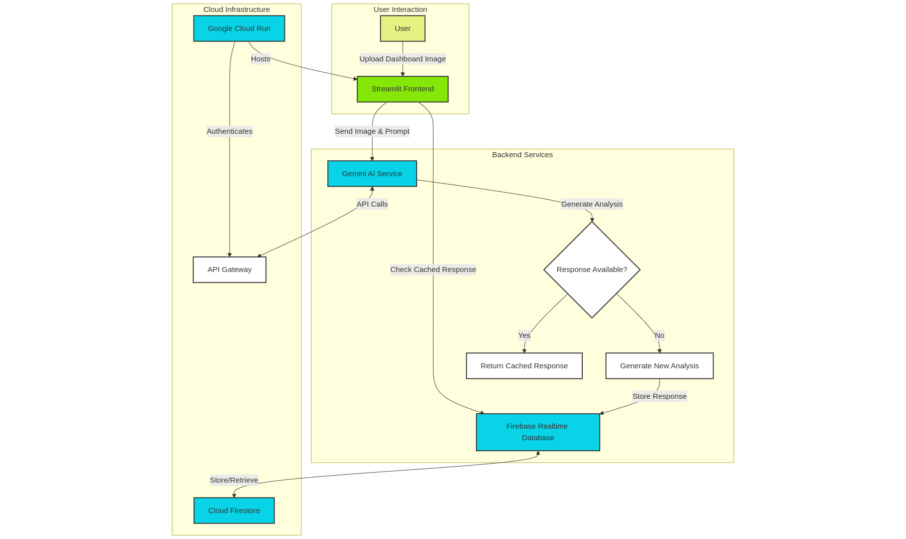
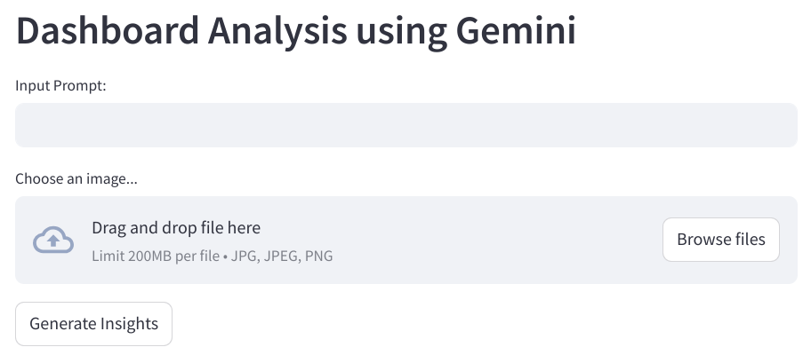

# Dashboard Analysis using Gemini

## Introduction
In today's data-driven landscape, businesses are inundated with complex dashboards. The challenge? Quickly and accurately extracting meaningful insights from these visual representations. Our solution? An intelligent dashboard analysis application that harnesses the power of Google's Gemini AI.

## Project Inspiration
As a data enthusiast, I've witnessed countless hours wasted manually interpreting dashboards. The idea was simple yet powerful: create an AI-powered tool that could:

- Automatically identify chart types
- Extract key variables
- Generate comprehensive summaries
- Provide instant insights

## Core Technologies
- **Frontend:** Streamlit
- **AI Engine:** Google Gemini AI (1.5 Flash)
- **Database:** Firebase Realtime Database
- **Deployment:** Google Cloud Run
- **Programming Language:** Python 3.9+

## Architectural Blueprint



### System Components

#### User Interface Layer
- Streamlit provides an intuitive, interactive frontend
- Allows seamless image uploads
- Renders AI-generated insights in real-time

#### AI Analysis Layer
- Gemini AI processes uploaded dashboard images
- Extracts complex visual information
- Generates structured JSON responses

#### Caching and Persistence Layer
- Firebase Realtime Database stores analysis results
- Implements binary image encoding
- Reduces redundant API calls

## Deep Technical Exploration

### 1. Firestore Database Integration
```python
import firebase_admin
cred = credentials.Certificate(credentials_dict)
firebase_admin.initialize_app(cred, {
    "databaseURL": os.getenv("FIREBASE_DATABASE_URL")
})
```
Initializing the Firestore Database connection to store the responses.

### 2. Image Processing Mechanism
```python
def input_image_setup(uploaded_file):
    try:
        if uploaded_file is not None:
            bytes_data = uploaded_file.getvalue()
            image_parts = [
                {
                    "mime_type": uploaded_file.type,
                    "data": bytes_data
                }
            ]
            return image_parts
        else:
            raise FileNotFoundError("No file uploaded")
    except Exception as e:
        st.error(f"Error processing image: {e}")
        return None
```
#### Key Processing Steps:
- Validates file upload
- Extracts byte data
- Prepares image for AI analysis
- Implements robust error handling

### 3. Intelligent Caching Strategy
```python
def store_response_in_firebase(identifier, response, encoding):
    try:
        response_ref = db.reference(f"/responses/{identifier}")
        response_ref.set({"response": response, "encoding": encoding})
    except Exception as e:
        st.error(f"Error storing response in Firebase: {e}")
```
#### Caching Mechanics:
- Uses SHA-256 for unique image identification
- Stores responses with binary-encoded identifiers
- Prevents redundant API calls
- Reduces computational overhead

### 4. Gemini AI Integration
```python
def get_gemini_response(input_text, image_data, prompt):
    try:
        model = genai.GenerativeModel('gemini-1.5-flash')
        response = model.generate_content([input_text, image_data[0], prompt])
        return response.text
    except Exception as e:
        st.error(f"Error generating response: {e}")
        return None
```
#### AI Analysis Workflow:
- Initializes Gemini 1.5 Flash model
- Processes text and image inputs
- Generates contextual responses
- Handles potential API errors gracefully

## Challenges and Innovative Solutions

### 1. Scalable Image Processing
- **Challenge:** Handling diverse dashboard formats
- **Solution:**
  - Flexible image upload support
  - Robust error handling
  - Adaptive AI model configuration

### 2. Performance Optimization
- **Challenge:** Minimizing API calls and response time
- **Solution:**
  - Binary image encoding
  - Firebase caching mechanism
  - Efficient data retrieval strategy

### 3. Error Resilience
- **Challenge:** Managing potential connection failures
- **Solution:**
  - Comprehensive try-except blocks
  - User-friendly error messages
  - Graceful degradation of functionality

## Deployment using Google Cloud Run
- Serverless deployment
- Auto-scaling infrastructure
- Seamless integration with Firebase
- Secure environment variable management

## Interface 



## Analysis Output
```json
{
  "Charts": {
    "Financial inflows and outflows over time": "A line chart showing the inflow and outflow of finances over time (monthly).",
    "Profit margin (%)": "A semi-circle chart showing the profit margin percentage.",
    "Outputs by type of expense (financial class)": "A bar chart showing the expenses categorized by type.",
    "Balance evolution (profit vs. loss)": "A bar chart showing the balance evolution over time (monthly).",
    "Expenses by business division": "A pie chart showing the expenses categorized by business division."
  },
  "Variables": {
    "Financial inflows and outflows over time": {
      "Date": ["Jan", "Feb", "Mar", "Apr", "May", "Jun", "Jul", "Aug", "Sep", "Oct", "Nov", "Dec"],
      "Inflow": [47000, 74000, 58000, 40000, 124000, 61000, 84000, 93000, 141000, 72000, 199000, 54000],
      "Outflow": [33000, 31000, 73000, 35000, 54000, 74000, 32000, 80000, 53000, 42000, 25000, 64000]
    },
    "Profit margin (%)": {
      "Profit Margin": "37.40%"
    },
    "Outputs by type of expense (financial class)": {
      "Expense Type": ["Personnel expenses", "Service expenses", "Administrative costs", "Business expenses", "Taxes"],
      "Amount": [215086.30, 170937.10, 116611.30, 110053.10, 20596.40]
    },
    "Balance evolution (profit vs. loss)": {
      "Date": ["Jan", "Feb", "Mar", "Apr", "May", "Jun", "Jul", "Aug", "Sep", "Oct", "Nov", "Dec"],
      "Profit/Loss": [-10000, -40000, 20000, 0, 70000, 10000, 50000, -10000, 90000, 30000, 170000, 10000]
    },
    "Expenses by business division": {
      "Business Division": ["HR", "Logistics", "Purchases", "Marketing", "Sales"],
      "Percentage": [34, 25, 22, 12, 7]
    },
    "Key Figures": {
      "Total Entries": "1M",
      "Total Outflows": "633K",
      "Final balance": "378K"
    }
  },
  "Summary": "The dashboard presents a cash flow analysis for the period 1/1/2021 to 12/31/2021.\n              It shows a total of 1 million entries, 633K in total outflows, and a final balance of 378K.  Profit margin was 37.4%.\n              Inflows and outflows fluctuated throughout the year.\n              Expenses are broken down by type and business division, with HR being the largest expense by division and Personnel Expenses being the largest by category.\n              The balance shows some monthly profit and losses, indicating some financial instability.\n              More detailed analysis would require access to the underlying data."
}
```

## Future Enhancement Roadmap

### 🚀 Planned Innovations:
- Multi-language dashboard support
- Advanced natural language processing
- Machine learning-powered trend prediction
- Enhanced chart type recognition
- Interactive insight exploration

## Conclusion
This project showcases the integration of AI, cloud services, and web technologies to develop intelligent data analysis tools. It enhances data analysis efficiency by storing and retrieving data from the database when the same input is provided.

## Technology Ecosystem
- 🐍 Python 3.9
- 🌐 Streamlit
- 🤖 Google Gemini AI
- 🔥 Firebase Realtime Database
- ☁️ Google Cloud Run

To learn more about Google Cloud services and to create impact for the work you do, get around to these steps right away:
- Register for Code Vipassana sessions
- Join the meetup group Datapreneur Social
- Sign up to become Google Cloud Innovator

---

Thanks for reading this article.

**Thanks Gowrinadh for your contribution in developing the project.**

If you enjoyed this article, please click on the clap button 👏 and share to help others find it!

**Empowering Data Understanding, One Dashboard at a Time! 📊🚀**
